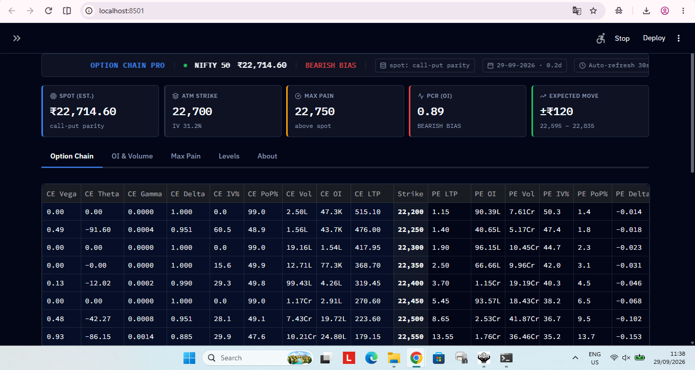
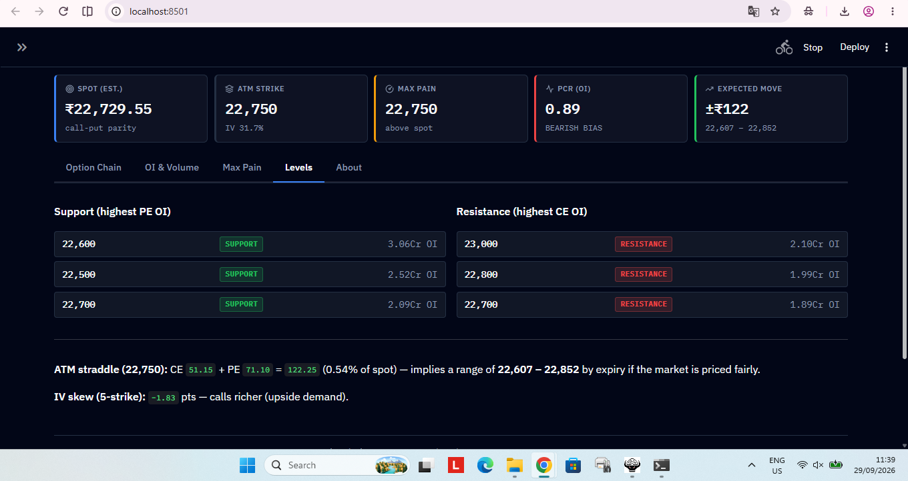

# OptionChainPro

A NIFTY 50 option-chain terminal for Streamlit, styled like an institutional
trading terminal (dark, dense, monospace numbers) and built on a small,
unit-tested analytics core.

No login or API key required — reads Upstox's public option-chain endpoint.
Data is delayed, not live.

## Screenshots





## Features

- **Full option chain**: CE/PE LTP, OI, Volume, IV, PoP, Greeks (Δ Γ Θ Vega),
  windowed around ATM, with a CSV export
- **Correct spot estimate**, shown with its source in the ticker bar:
  1. A `spot`-like field in the API response, if present
  2. **Put-call parity** (spot ≈ strike + call − put, at the strikes where
     they're closest, discounted for time to expiry) — this is what actually
     drives the estimate on Upstox's feed
  3. Manual override (sidebar)
  4. Last resort: highest-OI strike — flagged with a warning in the app when
     used, since it can be a round number far from the real price
- **Max Pain** — OI-weighted option-writer payout curve + strike
- **Support / Resistance** — top strikes by put OI / call OI
- **ATM straddle** → implied expected move by expiry
- **5-strike IV skew**
- Correct NIFTY lot size (**65**, NSE's Jan-2026 revision)
- Dark terminal UI: IBM Plex Sans + IBM Plex Mono, ITM shading, always-visible
  keyboard focus, 44px touch targets, `prefers-reduced-motion` respected, no
  horizontal scroll on mobile

## Project layout

```
optionchainpro/
├── app.py                  # Streamlit UI (imports optionchain.core)
├── optionchain/
│   ├── __init__.py
│   └── core.py              # Data fetch, parsing, analytics — pure Python, unit-tested
├── tests/
│   └── test_core.py         # 28 tests incl. a spot-estimate regression test
├── .streamlit/
│   └── config.toml          # Dark theme for native widgets & the table
├── requirements.txt
└── README.md
```

## Run it

```bash
pip install -r requirements.txt
streamlit run app.py
```

## Test it

```bash
pytest tests/ -v
```

## Disclaimer

Educational tool. Delayed public data. Not investment advice. Max Pain,
support/resistance, and the mood indicator reflect current OI positioning,
not predictions.
